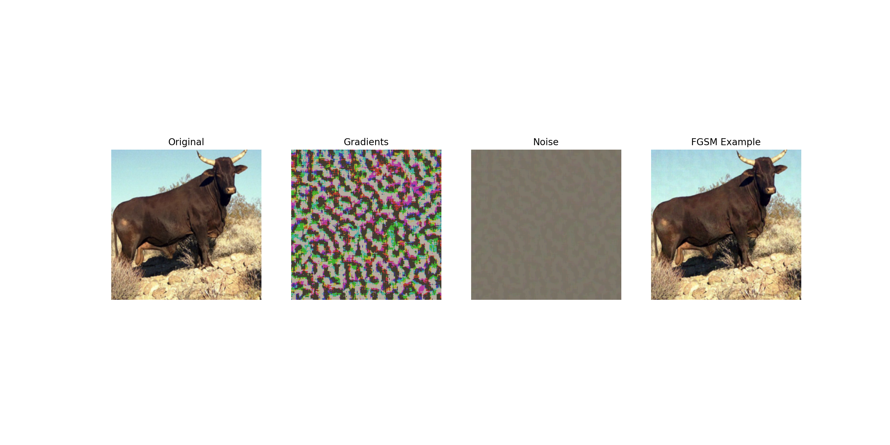
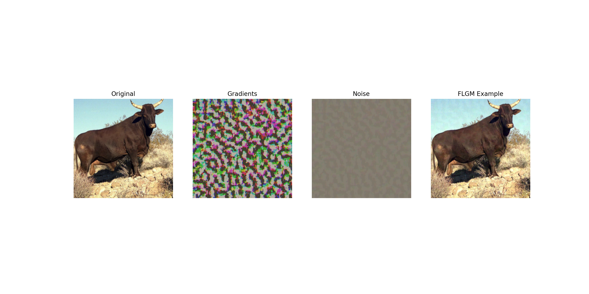
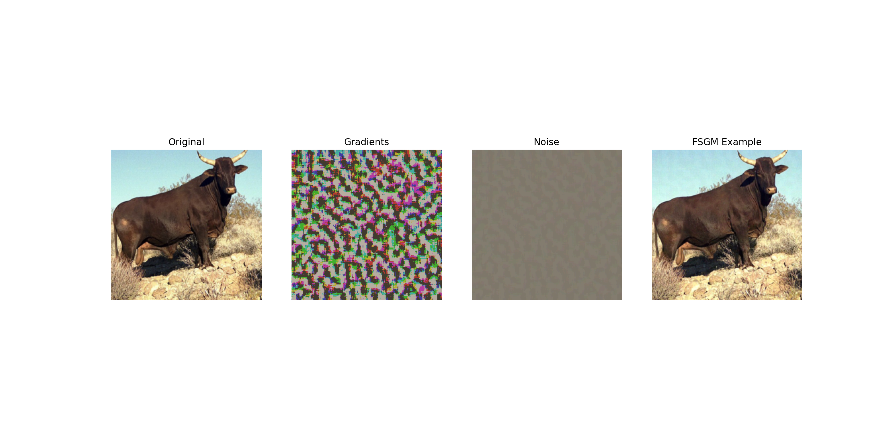

# Adversarial-Attack-Using-Gradients
Variations of FGSM (fast gradient sign attack) explored for generating adversarial examples.

## Overview
This is a project I undertook in a deep learning class at Korea University. The idea behind the project was to further investigate different methods of tweaking the popular FGSM algorithm to produce better adversarial examples that would cause a trained network to misclassify images. All of the algorithms developed were algorithms that used the internal gradients of the network in attack (white-box methods). A detailed summary of all of the algorithms shown in this repository are available in the adv_report.pdf file.

Our algorithms were tested on the MNIST, CIFAR10 and Imagenet datasets (although the report only showns examples from the MNIST and CIFAR10 dataset).

## Installation & Run
Run the following code to install all of the packages needed to run this repository:
```python
pip install -r requirements.txt
```
In order to generate your own adversarial examples, run the following:
```python
python main.py --generate --attack fgsm
```
Also please note that you need to provide your own data (images). You can download the MNIST and CIFAR10 datasets using the datasets object from torchvision. By default, my code is set to use the CIFAR10 dataset. You can change this from the config.py file, or add arguments before you run the code. Make sure you create a data folder or specifiy a location where you want the image files to be downloaded.

You can choose which attack algorithm you want to run. Furthermore, this will also test the algorihtm to see how well it performs against the network, and return a percentage indicating the number of correct classifications.

I have also uploaded the model parameters for ResNet18. There are two .pth files, one for CIFAR10 and one for Imagenet. These parameters are only trained on original images, and are not models trained for adversarial examples. For those, refer to MadryLab's adversarial examples challenge [here.](https://github.com/MadryLab/cifar10_challenge)

## Examples & Results
Please refer to the adv_report.pdf file for explanation of each algorithm, as well as performance on MNIST and CIFAR10 datasets. To following images show the results of using each attack algorithm. A random image of a bull was selected from the ImageNet dataset to test on. The attack algorithms are responsible for using the gradients to generate the "noise". The adversarial example is simply the original image plus the noise generated.

### FGSM



### FLGM


### FSGM


### FLOGM



## Conclusion
Will be updated soon.
